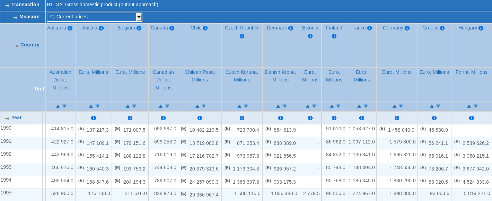
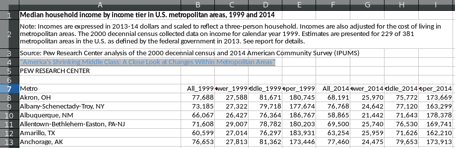

# Key Things to Know

## What to Remember from this Section
<br><br>

1. Lots of built-in data sets provided by R
2. Text files use delimiters - these determine the function to read in the data
3. There is no base R function to read in Excel data - must use a package
4. The [`haven`](http://github.com/tidyverse/haven) package can read and write SAS, Stata and SPSS files
5. Web scraping is a dense subject but scraping online text/Excel files *can* be as easy as reading in these files from your hard drive
6. SDMX APIs can be directly accessed from R using Java functions
7. Provider-specific functions can be created to extract and transform data from non-SDMX REST APIs

<div class="notes">
This is my *note*.

- It can contain markdown
- like this list
- Patricia

</div>

# Built-in Data

## Built-in Data Sets

- R has many built-in data sets
- type `data()` into your console (104 data sets should appear)

```{r}
mtcars
```

## Built in Data Sets

- R also has many convenient built-in character strings to be aware of
- Try these:

```{r, cache=TRUE, collapse=TRUE, eval=FALSE}
letters
LETTERS
month.abb
month.name
state.abb
state.division
state.name
state.region
```

<br>

### Note

- to load any of these data sets/strings into your global environment: `data("name of data set")`
- data sets that are part of unloaded packages can be loaded using `data(... package = ...)`
- type `?name` to get more information about the built-in data (the containing package must be loaded)

## Example

`1.` Load the `economics` data set
```{r, collapse=TRUE, eval=FALSE}
data(economics, package = "ggplot2")
```

`2.` What is this data measuring?
```{r, collapse=TRUE, eval=FALSE}
library(ggplot2)
?economics
```

Description from the help screen: "This dataset was produced from US economic time series data available from <URL: http://research.stlouisfed.org/fred2>. ‘economics’ is in "wide" format, ‘economics_long’ is in "long" format."

- `date` Month of data collection
- `psavert` personal savings rate
- `pce` personal consumption expenditures, in billions of dollars
- `unemploy` number of unemployed in thousands
- `uempmed` median duration of unemployment, in week
- `pop` total population, in thousands

# Importing Text Files

## Importing Text Files | .csv .txt .tsv

- Text files are a popular way to hold and exchange tabular data
- Text file formats use **delimiters** to separate the different elements
    - .csv
    - .txt
    - .tsv
- These delimiters help us know what functions to use to read in the data
- I'll illustrate with the following files in the R-Bootcamp dowhttp://127.0.0.1:4321/nload file
    - `mydata.csv`
    - `mydata.txt`
    - `mydata.tsv`

## Importing Text Files | Base R

Use `read.csv` for comma separated files (automatically sets the `sep = ","`)
```{r, cache=TRUE, collapse=TRUE, warning=FALSE}
read.csv("../data/mydata.csv")
```
<br>

Use `read.delim` for tab delimited files (automatically sets the `sep = "\t"`)
```{r, cache=TRUE, collapse=TRUE, warning=FALSE}
read.delim("../data/mydata.txt")
```

## Importing Text Files | Base R

When importing data, store as data.frame object by using the assignment operator:

```{r, cache=TRUE, collapse=TRUE, warning=FALSE}
mydata <- read.delim("../data/mydata.tsv")

mydata
```

<br>

- You now have a data object in your global environment named `mydata`
- View your data in a spreadsheet form:
    - clicking on the object in the global environment space or
    - type `View(mydata)` in your console

## OECD.Stat CSV Example

Open http://stats.oecd.org/Index.aspx?DataSetCode=SNA_TABLE1 in web browser, customise selection and export Text file (CSV)

&#9755; Transaction: `B1_GA` &#9755; Measure: `C`, `V` &#9755; Year: `1990-2015`

<center>

</center>


## OECD.Stat CSV Example

Read in the `sna_table1.csv` file and create object `sna_table1`

```{r, collapse=TRUE, cache=TRUE}
sna_table1 <- read.csv("../data/sna_table1.csv")
```

Take a peek at the object's data structure

```{r, collapse=TRUE, cache=TRUE, eval=TRUE}
str(sna_table1, width = 100, strict.width = "cut")
```


# Importing Excel Files

## Importing Excel Files

- Excel is still the spreadsheet software of choice
- Base R does not have an Excel importing function but we can use the [`readxl`](https://cran.rstudio.com/web/packages/readxl/) package

```{r, collapse=TRUE, cache=TRUE, warning=FALSE}
# if you haven't installed the readxl package run the following line (minus hashtag)
# install.packages("readxl")

library(readxl)

read_excel("../data/mydata.xlsx", sheet = "Sheet5")
```

- Benefits of `readxl`
    - recognizes date and time variables
    - keeps text variables as characters rather than factors (more to come on this)
    - does not collapse variable names
    - read more about `readxl` capabilities [here](https://cran.r-project.org/web/packages/readxl/README.html)
- `xlsx` and `XLConnect` are alternative packages for reading and writing Excel files

## Example

Read in the spreadsheet `3. Median HH income, metro` in the `PEW Middle Class Data.xlsx` file

&#9755; We need to specify the sheet using `read_excel(..., sheet = ...)`

&#9755; We need to skip 5 lines using `read_excel(..., skip = ...)`

**Hint:** `?read_excel` provides help on function parameters

<center>

</center>

## Example

Read in the `.xlsx` file and save as `pew`

```{r, collapse=TRUE, cache=TRUE, warning=FALSE}
pew <- read_excel("../data/PEW Middle Class Data.xlsx", sheet = "3. Median HH income, metro", skip = 5)
```

Take a peek at what this data looks like

```{r, collapse=TRUE, cache=TRUE, eval=TRUE}
head(pew)
```


# Importing SAS and Stata files

## Importing SAS Files

- The SAS System uses a prorpietary binary format for data files (`.sas7bdat` and ` .sas7bcat`)
- The [`haven`](http://github.com/tidyverse/haven) package leverages the
  [ReadStat](https://github.com/WizardMac/ReadStat) C library to read both file
  formats and write `.sas7bdat`

```{r, collapse=TRUE, cache=TRUE, warning=FALSE}
library(haven)

helpfromSAS <- read_sas("../data/help.sas7bdat")
str(helpfromSAS[, 1:2])
```

- Benefits of `haven`
    - date times are converted to corresponding R classes
    - labelled vectors are returned as a new labelled class
    - can easily coerce to factors or replace labelled values with missings
    - all functions return tibbles
    - read more about the C library [here](https://github.com/WizardMac/ReadStat)

## Importing Stata Files

- `haven`/`ReadStat` can read Stata files up to version 14 (latest) and save objets as `.dta`
- Stata missing values are displayed as `NaN`

```{r, collapse=TRUE, cache=TRUE, warning=FALSE}
carsdataSTATA <- read_dta("../data/carsdata.dta")
psych::describe(carsdataSTATA, skew = FALSE)

carsdataSTATA$cars[1] <- NA
write_dta(carsdataSTATA, path = "../data/carsdata_out.dta", version = 14)

read_dta("../data/carsdata_out.dta")[1:3,]
```

- Supports Stata "extended" missing values, `.A` through `.Z` using a tagged `NA` in R
- See [semantics](https://github.com/tidyverse/haven/blob/master/vignettes/semantics.Rmd) vignette of `haven` package for additional information


# Reading Online Files

## Reading Online Files | Tabular files

- Download URLs to csv and Excel files can be passed directly to R functions
- For inspection with other tools, the file can be downloaded first using `download.file()`

```{r, collapse=TRUE, cache=TRUE, eval=TRUE}
url <- "https://inventory.data.gov/dataset/f6f06df8-c102-4fe8-af31-c368be66166d/resource/d65072b5-08f0-4f90-bd57-65e731c59df2/download/userssharedsdfdata.govfederalagencyparticipation.csv"
data_gov <- read.csv(file = url, stringsAsFactors = FALSE)
str(data_gov, width = 100, strict.width = "cut", list.len = 2)

## download file
destfile <- tempfile(fileext = ".csv")
download.file(url = url, destfile = destfile)
data_gov <- read.csv(file = destfile, stringsAsFactors = FALSE)

str(data_gov, width = 100, strict.width = "cut", list.len = 2)
```

## Reading Online Files | Excel files

- Reading online Excel files follows a similar process
- `gdata` package is particular easy to use

Let's download some data from [Fair Market Rents for Section 8 Housing](http://catalog.data.gov/dataset/fair-market-rents-for-the-section-8-housing-assistance-payments-program/resource/2d33555e-5d21-4baf-84a2-e4fb3aed0807):

```{r, collapse=TRUE, cache=TRUE, eval=TRUE}
suppressMessages(library(gdata))

url <- "http://www.huduser.org/portal/datasets/fmr/fmr2015f/FY2015F_4050_Final.xls"

# use read.xls to import
rents <- read.xls(url)

str(rents, list.len = 5)
```


## Example | Reading file from Dropbox
<br>
<br>

<font size="7">
`1.` Download the file stored at:<br>
</font>

<font size="5">
`https://dl.dropboxusercontent.com/u/1807228/reddit.csv?dl=1`
</font>

<br>

<font size="7">
`2.` Save it as an object titled `reddit`
</font>

<br>

<font size="7">
`3.` Inspect the data structure
</font>


## Example

`1.` Retrieve the file contents stored at: https://dl.dropboxusercontent.com/u/1807228/reddit.csv?dl=1

```{r, collapse=TRUE, cache=TRUE, eval=TRUE}
suppressMessages(library(RCurl))
url <- "https://dl.dropboxusercontent.com/u/1807228/reddit.csv?dl=1"
tt <- getURL(url)
substr(tt, 1, 100)
```

`2.` Save it as an object titled `reddit`

```{r, collapse=TRUE, cache=TRUE, eval=TRUE}
reddit <- read.csv(url)
```

`3.` Inspect the data structure

```{r, collapse=TRUE, cache=TRUE, eval=TRUE}
str(reddit)
```

# SDMX

## SDMX

- Standard for Data and Metadata Exchange
- International Organisations (OECD, Eurostat, ECB, IMF, World Bank, Unesco, ILO)
- OECD.Stat: National `Accounts` > `Annual National Accounts` > `Main Aggregates` > `GDP`
- Use `Export (SDMX)`
- modify URL in SDMX browser at [sdmx.rdata.work](http://sdmx.rdata.work/OECD/SNA_TABLE1.*.B1_GA.C+V/?start=1990&end=2015)
- download file from [sdmx.rdata.work](http://sdmx.rdata.work/getdownloadsdmx?) using `getURL()`

```{r, collapse=TRUE, cache=TRUE, eval=FALSE}
http_response <- getURL("http://sdmx.rdata.work/OECD/SNA_TABLE1.*.B1_GA.C+V/?start=1990&end=2015")
tt <- getURL("http://sdmx.rdata.work/getdownloadsdmx?")
read.csv(text = tt)[1:3, 1:3]
```

```{r, collapse=TRUE, cache=TRUE, echo=FALSE, warning=FALSE}
## dat <- read.csv(text = tt)
## write.csv(dat, file = "../data/sdmxwide.csv", row.names = FALSE)
read.csv("../data/sdmxwide.csv")[1:3, 1:3]
```

- constantly growing number of providers
- few providers use latest standard of SDMX, making it difficult to develop tools
- [SDMX Java functions](http://github.com/amattioc/SDMX) available for a range of tools (R, SAS, Matlab, Stata, Excel)


# curling REST APIs

## curling REST APIs

- National Statistical Offices have started setting REST APIs for public data retrieval
- The majority of NSOs create their individual API and few use existing community standards
- [`nsoApi`](https://github.com/bowerth/nsoAPI) provides functions to harmonize information into an R time series format
- [opendata-tables](https://www.gitbook.com/read/book/bowerth/opendata-tables) lists tables that can be retrieved from SDMX, PXWEB and other standards
- Some of the providers require registration, e.g. the BEA (USA) and ONS (UK)
- GENESIS (Germany) requires a paid subscription to access the REST API

```{r, collapse=TRUE, cache=TRUE, eval=TRUE}
library(nsoApi)
cbs_data <- cbsODataAPI(api="http://opendata.cbs.nl/ODataApi/OData/", DSD="82572ENG", scheme="TypedDataSet")
head(cbs_data[, 1:4])
```

- examples for other providers available in [nsoApi package vignette](https://github.com/bowerth/nsoApi/blob/master/vignettes/nsoApi.md)

# Key Things to Remember

## Remember These Functions!

Operator/Function       Description
-----------------       ----------------
`data()`                access built-in data sets
`?`                     will provide you information regarding built-in data (i.e. `?mtcars`)
`read.csv()`            base R function for reading in .csv files (can also be used to read in a .csv file stored online)
`read.delim()`          base R function for reading in .txt and .tsv files
`read_excel()`          imports Excel data (provided by the `readxl` package)
`read.xls()`            imports Excel data stored online (provided by the `gdata` package)
`read_sas()`              imports `.sas7bdat` and `.sas7bcat` files (provided by the `haven` package)
`read_dta()`            imports Stata files (provided by the `haven` package)
`View()`                opens a spreadsheet-style data viewer
-----------------       ----------------

- [R Data Import/Export](https://cran.r-project.org/doc/manuals/r-devel/R-data.html) manual

<!-- ## Break {.flexbox .vcenter} -->

<!-- <div class="centered"> -->

<!-- <font size="10">5 minutes!</font> -->

<!-- </div> -->


